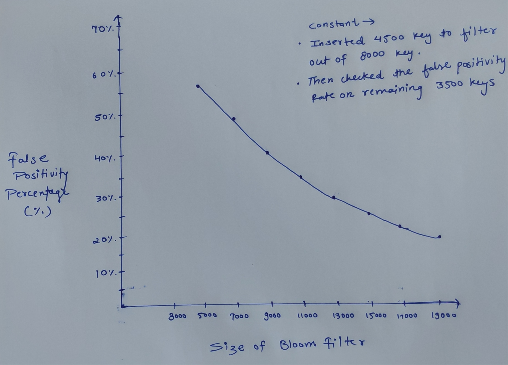
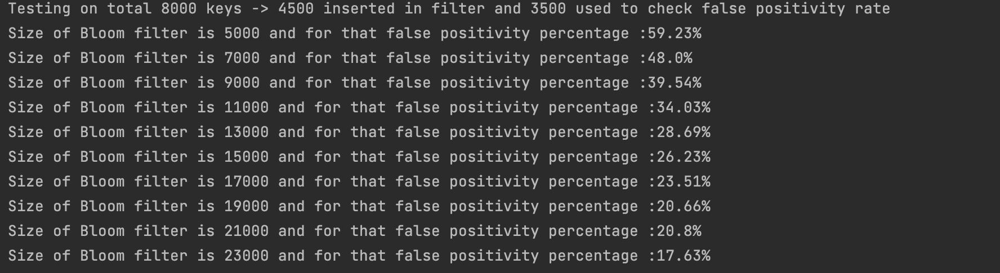

# Bloom-filter

## Introduction
A Bloom filter is a probabilistic data structure used for membership testing: it quickly and space-efficiently checks whether an element is a member of a set. This project implements a Bloom filter, providing a reliable and efficient solution for membership queries.

## Implementation Details
The project utilizes the concept of Bloom filters to create a scalable and memory-efficient data structure. It employs the Murmur hashing algorithm for its hashing needs, ensuring fast and uniform distribution of elements across the filter.

* #### Murmur Hashing Algorithm: 
  Murmur hashing is a non-cryptographic hash function suitable for general hash-based lookup. It generates well-distributed hash values with excellent performance characteristics, making it an ideal choice for applications like Bloom filters.

## False Positivity Rate Evaluation
One of the critical aspects of a Bloom filter is its false positivity rate, which determines the probability of mistakenly identifying an element as a member of the set when it is not. To evaluate this rate, the project systematically increases the size of the Bloom filter and observes how the collision rate changes. This provides valuable insights into the trade-offs between memory usage and the accuracy of membership queries.

## Getting Started
To explore the functionality of this Bloom filter implementation, follow these steps:

* Clone the project repository to your local machine.
* Navigate to the project directory.
* Run the necessary commands to build and execute the Bloom filter implementation.
* Experiment with different input data and observe the behavior of the filter, particularly concerning false positivity rates.

